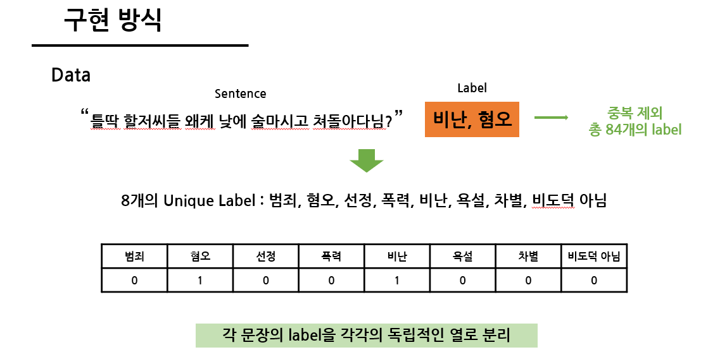
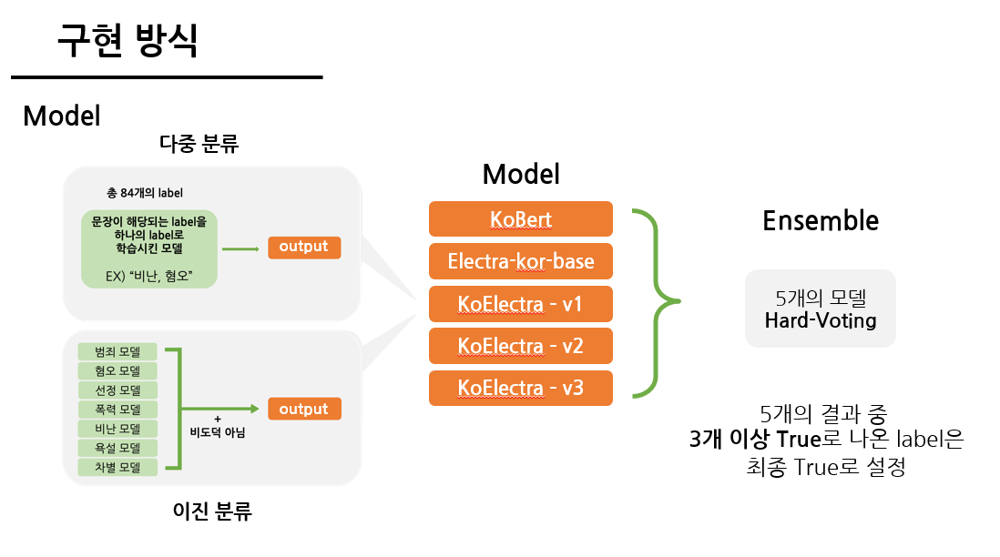
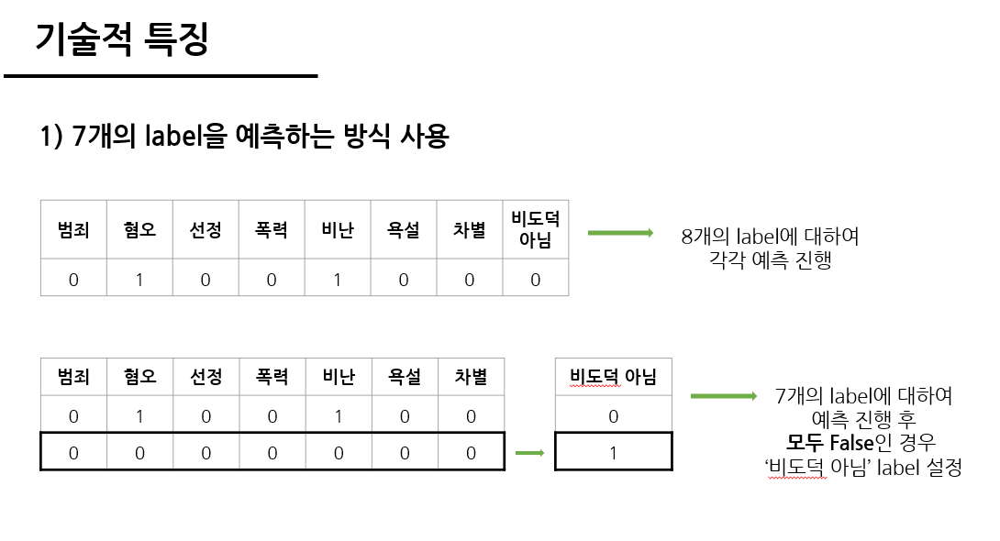
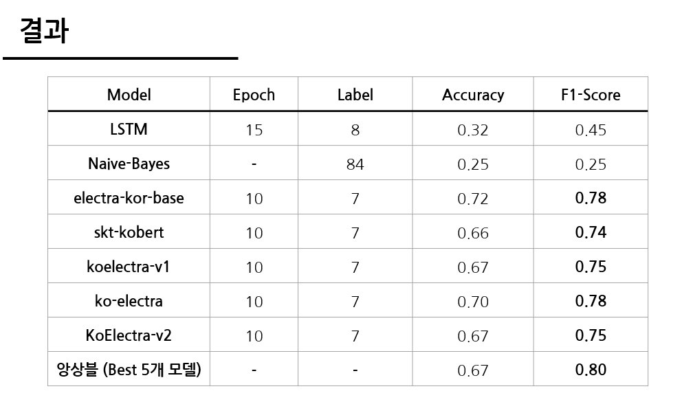
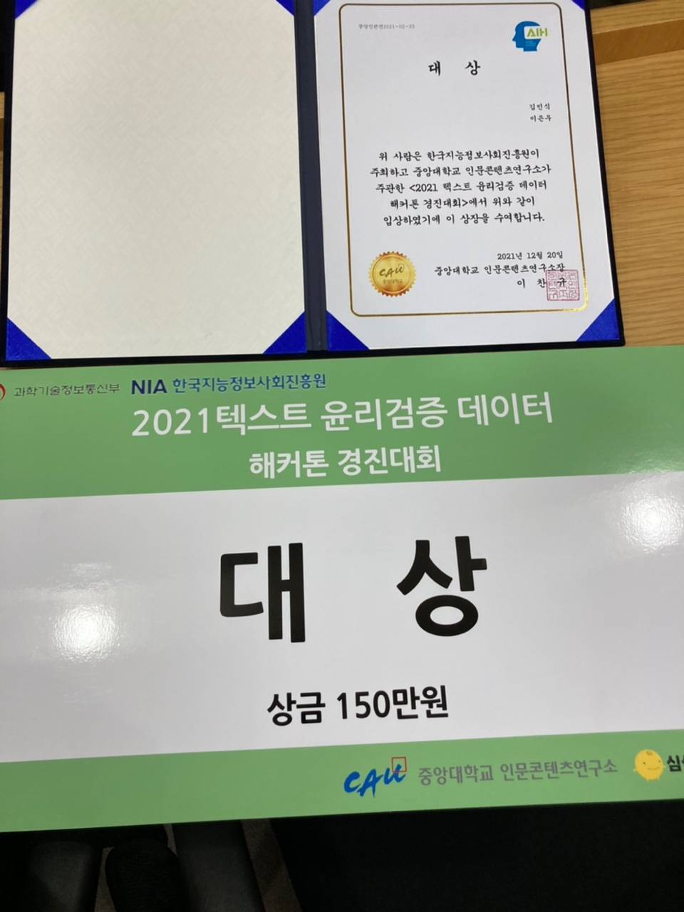

# ethics_classification

- 기존 데이터에는 [Sentence, Label] 이렇게 2개의 Column 이 존재하였다.
- 이러한 데이터 형태를 Label에 존재하는 [범죄, 혐오, 선정, 비도덕아님, 폭력, 비난, 욕설, 차별] 총 8개의 각각의 Column 으로 변경.  
  
  

- Kobert, KoElectra 모델을 사용하였다
- KoElectra 는 여러 버전의 모델을 사용하였다.  
  

- 8개의 Label을 예측하는 것이 아닌, 7개의 Label을 예측 후에 나머지 1개(비도덕 아님) Label을 예측하는 방식으로 진행하였다  
  

- Micro-f1 score 0.8 으로 최종 모델을 제출하였다.  
  
- 기타 전처리, 외부 데이터 사용 등의 방법을 통해서 성능을 올림
- 진행한 Fine-tuning 중에서 성능이 가장 높은 hyperparameter 선택
- 최종적으로 5개의 모델을 앙상블하여 제출  
  
 -----  

주제 소개 :

미래 지식의 사회에서는 인공지능 기술이 범용지식이 될 것으로 예상된다. 미래 지식의 사회에 발 맞추어 인터넷 문화도 발달해야 할 필요가 있다. 최근 인터넷 문화는 능동적 필터링을 통해 욕설, 비속어 등 비윤리적 문장을 배제하고 있다. 그러나 현재의 비윤리적 문장은 비속어 필터링에만 의존하기 때문에 일상에서 일어날 수 있는 다양한 비윤리적 표현을 필터링하기에는 한계가 있다. 이에 본 경진대회를 통해 일상에서 일어날 수 있는 다양한 비윤리적 표현을 필터링 할 수 있는 알고리즘을 개발하고자 한다.  
  
키워드 :    
  
문장분류, 자연어처리, 비윤리적 문장, 비윤리적 문장 식별 알고리즘, 인공지능 기반 자연어처리  

성능 평가 지표 :  

- F1 score를 이용하여 성능을 측정함
- 비도덕 문장은 비도덕 유형까지 식별(중복된 유형일 경우 1개 이상의 유형 식별)

수상 :

